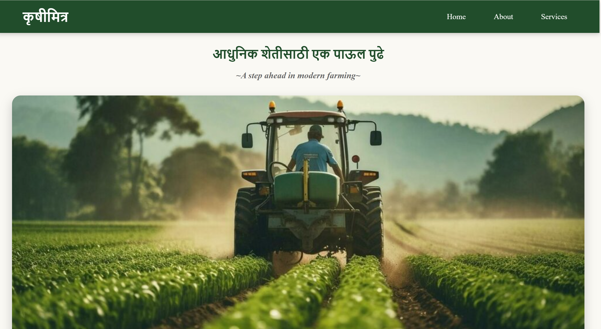

# 🌾 Krushi Mitra

Krushi Mitra is a Django-based web application developed to support farmers by providing agricultural information, market prices, government schemes, training resources, expert guidance, and latest agricultural news in one platform.

## 🚀 Features

- 🌱 Crop Information
- 📈 Market Price Updates
- 🏛 Government Schemes
- 👨‍🌾 Expert Guidance
- 🎓 Farmer Training Programs
- 📰 Agricultural News Updates

## 🛠 Tech Stack

- Python
- Django
- SQLite
- HTML5
- CSS3

## 📂 Project Structure

```text
Krushi-Mitra/
│
├── farmer/
├── krushimitra/
├── static/
├── templates/
├── screenshots/
├── manage.py
└── README.md
```

## 📸 Screenshots

### Home Page


### Crop Information


### Market Price Updates


### Agricultural News


## ⚙️ Installation & Setup

### 1. Clone the Repository

```bash
git clone https://github.com/shravani0540/Krushi-Mitra.git
```

### 2. Navigate to Project Directory

```bash
cd Krushi-Mitra
```

### 3. Install Dependencies

```bash
pip install django
```

### 4. Apply Migrations

```bash
python manage.py migrate
```

### 5. Run the Development Server

```bash
python manage.py runserver
```

### 6. Open in Browser

```text
http://127.0.0.1:8000/
```

## 🎯 Purpose

The main objective of Krushi Mitra is to provide farmers with easy access to agricultural resources, crop information, market trends, government schemes, and expert support through a simple web platform.

## 👩‍💻 Author

**Shravani Dewade**

Bachelor of Engineering (Computer Science & Engineering)

GitHub: https://github.com/shravani0540